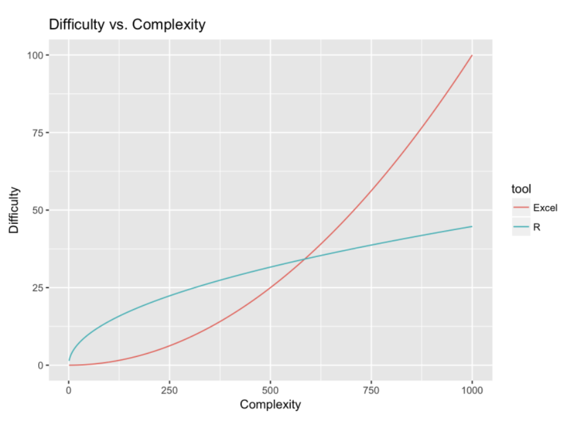
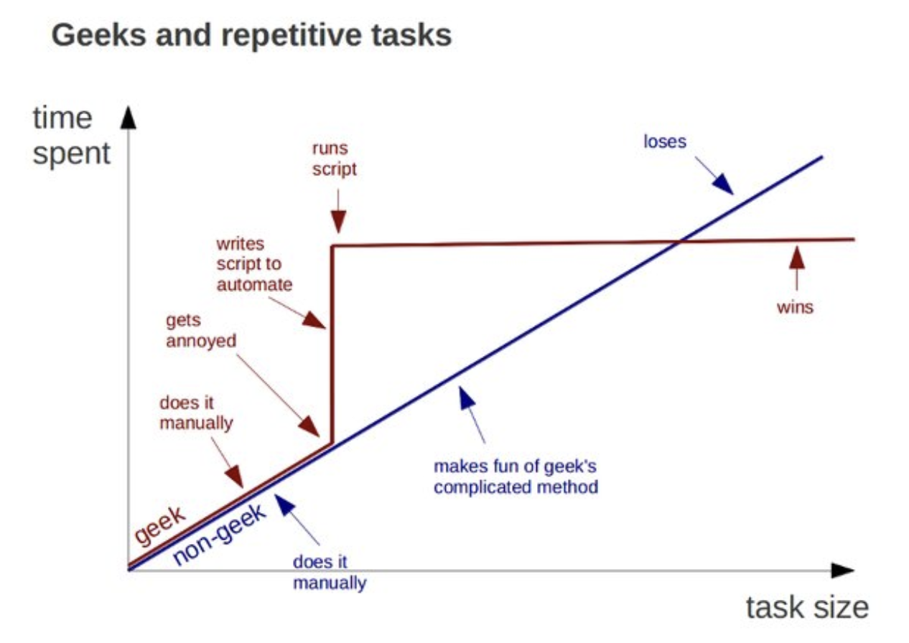

# R en quelques mots

## Pourquoi ?

Langage de programmation qui permet de :
- manipuler des données : importer, transformer, exporter faire des analyses statistiques plus ou moins complexes : description, exploration, modélisation...
- créer des (jolies) figures

## Comment l'avoir ? 

Disponible sur [RCRAN](https://cran.r-project.org/)

## Sur quel OS ? 

Tous ! 

## Historique

- 1993 : Début du projet R
- 2000 : sortie de R 1.0.0
- 2022 : R 4.2.2

## R vs Excel


Source: R-bloggers

### Pourquoi plus Excel ?

Un exemple parmi tant d'autres ! 


Source Alexandre Counis, Les Echos, 5 oct. 2020

## Avantages et inconvénients

### Avantages

- Souplesse d’utilisation pour réaliser des analyses statistiques
- Libre et gratuit, même s'il existe maintenant des versions payantes de RStudio (shiny et/ou server)
- Reproductibilité des analyses en écrivant/sauvegardant les commandes R dans des scripts
- Large communauté d’utilisateurs/aide en ligne
- Grand nombre de packages spécifiques

### Inconvénients

## Geeks and repetitive tasks



## R sait tout faire

Lire un tableau de données

```R
read.table()
```

Fusionner deux tableaux

```R
merge()
```

Filtrer des lignes

```R
data[data$x > 10]
```

Sélectionner des colonnes

```R
data[,c(“x”,”y”)]
```

Rechercher une chaîne de caractères

```R
grep()
```

Réaliser une ACP

```R
prcomp()
```

Calculer une moyenne

```R
mean()
```

Additionner deux matrices

```R
mat1 + mat2
```

Exporter un tableau de données

```R
write.table()
```

Calculer une variance

```R
var()
```

Régression linéaire

```R
lm()
```

Tracer une courbe

```R
plot()
```

Tester une hypothèse

```R
t.test()
```

Dessiner un histogramme

```R
hist()
```

Convertir des données

```R
as.matrix()
```

