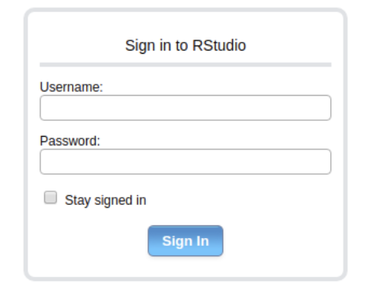
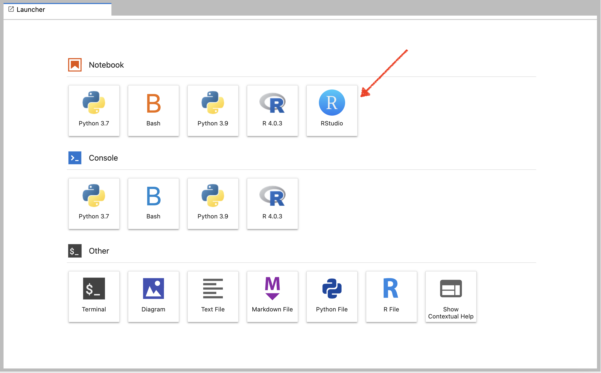

# Comment utiliser R ?

## Modes d’utilisation (liste non exhaustive)

- Localement via le terminal
- Localement via RStudio (utilisation classique)
- Sur un serveur via le terminal et une connexion ssh
- Sur un serveur via un navigateur web pour accéder à RStudio server
- Sur un serveur via un navigateur web pour accéder à RStudio server par Jupyter

## Ouverture ou connexion à RStudio

3 alternatives :

1. Ouvrir RStudio sur votre propre ordinateur (si installé)

2. Vous connecter au serveur Web RStudio de l’IFB 
https://rstudio.cluster.france-bioinformatique.fr
puis vous identifier

3. Vous connecter via Jupyter lab de l’IFB
https://jupyterhub.cluster.france-bioinformatique.fr
puis cliquer sur l'icône RStudio

